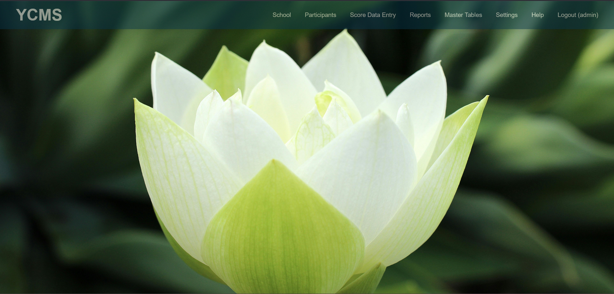
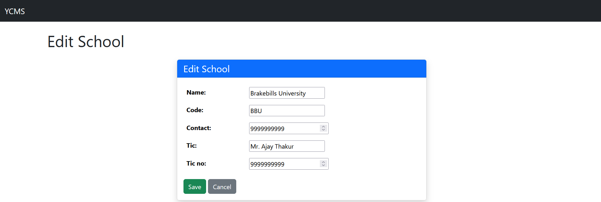
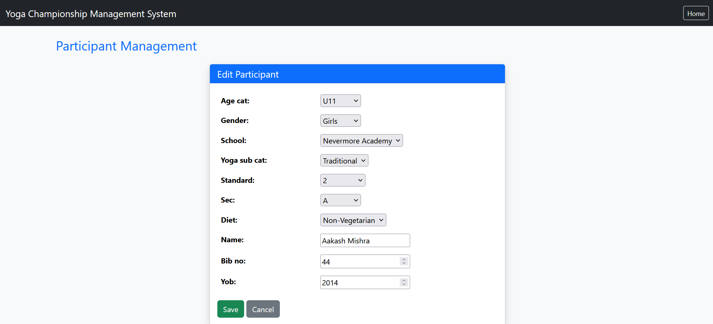
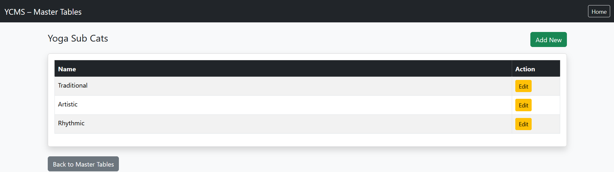
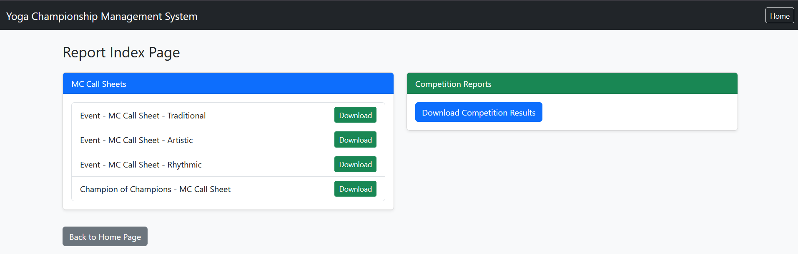

# Yoga Championship Management System (YCMS)

## 1. Description
Django application to automate report generation required for smooth conduct of Inter-School Yoga Competition.

Part of a passion project to create software for educational purposes.

## 2. Features
- School registration, editing, and listing
- Participant registration, editing, and listing
- Score data entry for Yoga Sub-Category and Champion of Champions
- MC Call Sheet generation and Competition Results download
- Master Tables maintenance (admin only)
- Settings management (admin only)
- Built-in Help page with role-based navigation guide

## 3. Screenshots
### Dashboard

### School Management

### Participant Management

### Yoga Sub Categories

### Reports Download

## 4. Tech Stack
- Python 3
- Django 6
- SQLite3
- Bootstrap, HTML, CSS

## 5. Project Structure
- ycms/: project settings and root URL configuration
- dashboard/: login, session context, and dashboard navigation
- school/: school CRUD
- participant/: participant CRUD
- dataentry/: bib verification and score entry
- report/: call sheets and competition results export
- masters/: master table CRU via dynamic registry
- setting/: system settings screens
- help/: in-app user manual

## 6. Setup and Installation
1. Create and activate a Python virtual environment.
2. Install dependencies:
   - pip install -r requirements.txt
3. Configure environment variables:
   - THE_SECRET_KEY
   - MY_DEBUG (True or False)
4. Apply migrations:
   - python manage.py migrate

## 7. Running the Application
1. Start the development server:
   - python manage.py runserver 127.0.0.1:8000
2. Open in browser:
   - http://127.0.0.1:8000/

## 8. Authentication and Roles
- Session-based login is implemented in dashboard module.
- Admin role can access Master Tables and Settings.
- User role can access School, Participants, Score Data Entry, and Reports.
- Unauthenticated users are redirected to login for protected pages.

## 9. Navigation Guide
- Dashboard -> School -> Register School / Edit School / List Registered Schools
- Dashboard -> Participants -> Register Participants / Edit Participants / List Registered Participants
- Dashboard -> Score Data Entry -> Yoga Sub-Category / Champion of Champions
- Dashboard -> Reports -> Event MC Call Sheets / Champion of Champions MC Call Sheets / Competition Results
- Dashboard -> Master Tables -> Master Tables - CRU (admin only)
- Dashboard -> Settings -> Set Settings (admin only)
- Dashboard -> Help -> User Manual

## 10. Reports
- Event MC Call Sheets by yoga sub-category
- Champion of Champions MC Call Sheet
- Competition Results export as text file

## 11. Data Model Notes
- AuthRole, AuthUser for role-based access
- School and Participant as core registration entities
- ScoreIndividual for score capture and reporting
- Master tables: Age Category, Gender, Yoga Sub-Category, Standard, Section, Food Preference

## 12. Known Limitations and TODO
- Some report rules are currently hardcoded and should move into Settings for flexibility.
- Plain credential comparison is currently used in custom auth flow.
- Additional automated tests can improve release confidence.
- Planned deployment on PythonAnywhere; paste the live project URL in this README after deployment.
